---

## 1. Kiến trúc tổng quan (System Architecture)

### 1.1 High-Level Architecture

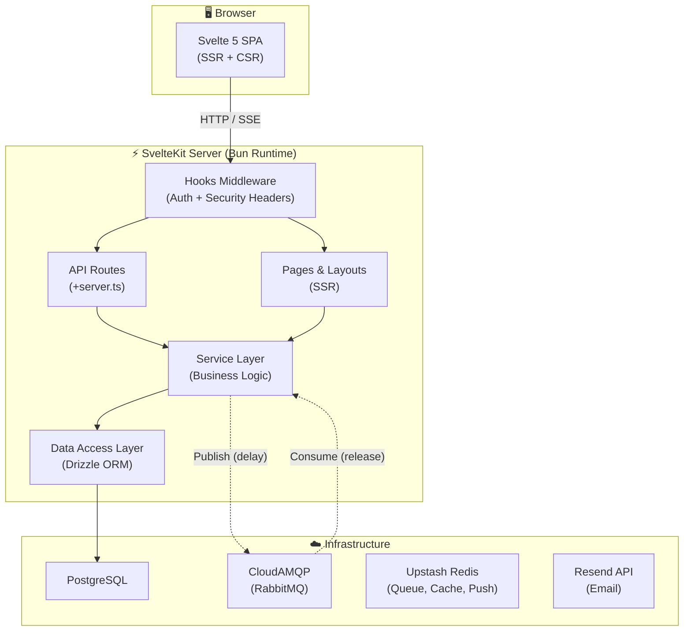

---

### 1.2 Request Flow

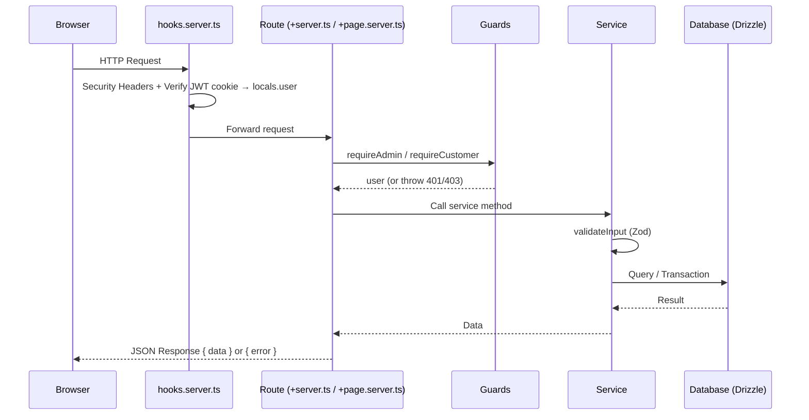

---

## 2. Phân lớp ứng dụng (Application Layers)

### 2.1 Tổng quan các lớp

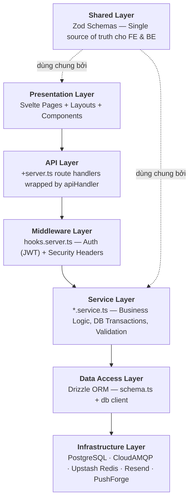

### 2.2 Chi tiết từng lớp

### Presentation Layer

```
src/routes/
├── (admin)/admin/                # Layout group cho Admin
│   ├── +layout.svelte            # Sidebar + Header
│   ├── +layout.server.ts         # Guard: requireAdmin
│   ├── +page.svelte              # Dashboard
│   └── events/
│       ├── +page.svelte          # Danh sách sự kiện
│       └── [id]/
│           └── +page.svelte      # Chi tiết Event + Quản lý Shows & Seatmap
├── (customer)/                   # Layout group cho Customer
│   ├── +layout.svelte            # Navbar + Footer
│   ├── +page.svelte              # Trang chủ (danh sách sự kiện)
│   ├── events/
│   │   └── [id]/
│   │       └── +page.svelte      # Chi tiết sự kiện + chọn Show
│   └── me/
│       └── tickets/+page.svelte  # Vé của tôi
├── (auth)/
│   ├── login/+page.svelte
│   └── register/+page.svelte
└── +error.svelte
```

**Nguyên tắc:**

- Page chỉ lo **hiển thị** và **tương tác**
- Dữ liệu load qua `+page.server.ts` hoặc `+page.ts`
- Không gọi DB trực tiếp trong page

---

### API Layer

```
src/routes/api/
├── auth/
│   ├── register/+server.ts       # POST
│   ├── login/+server.ts          # POST
│   ├── logout/+server.ts         # POST
│   ├── forgot-password/+server.ts # POST (Gửi email Resend)
│   └── reset-password/+server.ts  # POST (Xác thực HMAC token)
├── categories/
│   ├── +server.ts                # GET list
│   └── [id]/+server.ts           # GET/PATCH/DELETE
├── events/
│   ├── +server.ts                # GET list+search
│   ├── [id]/
│   │   ├── +server.ts            # GET detail
│   │   ├── checkout/+server.ts   # POST purchase (hold seats)
│   │   ├── publish/+server.ts    # PATCH draft → published
│   │   ├── sections/+server.ts   # PUT replace sections (admin, draft only)
│   │   └── shows/
│   │       └── [showId]/
│   │           ├── +server.ts    # PATCH/DELETE show
│   │           └── seats/+server.ts  # GET seat map
│   └── create/
│       ├── basic-info/+server.ts # POST/PATCH step 1
│       ├── shows/+server.ts      # POST/PUT step 2
│       └── seatmap/+server.ts    # POST step 3
├── orders/
│   └── [id]/
│       └── checkout/+server.ts   # POST payment
└── me/
    └── tickets/+server.ts        # GET
```

**Nguyên tắc:**

- Dùng wrapper `apiHandler` cho toàn bộ các route, **KHÔNG sử dụng try/catch** thủ công.
- Chỉ chứa logic điều hướng: gọi Guards (phân quyền) → parse input (nếu cần) → gọi Service → trả response { data }.
- Phân quyền bằng các hàm Guard (VD: `requireAdmin(locals)`), Guard sẽ tự ném lỗi nếu không hợp lệ.

**Pattern chuẩn:**

```tsx
// src/routes/api/events/[id]/checkout/+server.ts
import { apiHandler } from '$lib/server/handler';
import { requireCustomer } from '$lib/server/auth/guards';

export const POST = apiHandler(async ({ request, params, locals }) => {
  // 1. Guard check (Tự động ném AppError 401/403 nếu lỗi)
  const user = requireCustomer(locals);

  const body = await request.json();
  const eventId = Number(params.id);

  // 2. Gọi Service (Service tự lo validation và ném lỗi nghiệp vụ)
  const result = await purchaseService.purchaseTickets(user.id, eventId, body);

  // 3. Trả về thành công
  return json({ data: result }, { status: 200 });
});
```

---

### Service Layer

```
src/lib/server/services/
├── auth.service.ts        # Register, login, verify
├── category.service.ts    # CRUD danh mục sự kiện
├── event.service.ts       # Tạo sự kiện (3-step flow), lấy danh sách, publish
├── show.service.ts        # CRUD suất diễn (shows/sessions)
├── seatmap.service.ts     # Tạo/cập nhật seatmap (sections + seats) cho show
├── seat.service.ts        # Lấy sơ đồ ghế cho customer
├── purchase.service.ts    # Hold seats (row lock), cart replacement, idempotency
├── order.service.ts       # Checkout (payment), my tickets
├── queue.service.ts       # (Planned) Virtual queue: join, check status, grant access
└── stats.service.ts       # (Planned) Revenue, occupancy, demographics
```

**Nguyên tắc:**

- Chứa **toàn bộ business logic** và quản lý **database transactions**.
- Sử dụng hàm `validateInput(schema, data)` để kiểm tra dữ liệu đầu vào.
- Bắt buộc throw lỗi thông qua class `AppError` hoặc danh mục `Errors` (VD: `throwError(Errors.NO_SEATS)`, `throw Errors.VALIDATION(details)`).
- Gọi MQ producer khi cần và Emit SSE events khi data thay đổi.

---

### Infrastructure Layer

```
src/lib/server/
├── db/
│   ├── index.ts           # Drizzle client singleton
│   ├── schema.ts          # Table definitions + relations
│   ├── seed.ts            # Seed runner
│   ├── seed-data.ts       # Event/Show/Section seed data
│   ├── seed-admin.ts      # Admin user seed
│   └── seed-tickets.ts    # Ticket seed data
├── auth/
│   ├── jwt.ts             # Sign / verify auth token (jose)
│   ├── password.ts        # Hash / compare (argon2id)
│   └── guards.ts          # requireAuth, requireAdmin, requireCustomer
├── mq/
│   └── connection.ts      # AMQP connection (CloudAMQP) — basic publish
├── validators/
│   ├── seat-overlap.validator.ts   # Section overlap & requirement checks
│   └── disabled-seats.validator.ts # Disabled seat validation
├── redis.ts               # Upstash Redis client (Singleton)
├── push.ts                # PushForge Builder config
├── config.ts              # Env validation via Zod (fail-fast)
├── errors.ts              # AppError class + predefined error catalog
└── handler.ts             # apiHandler wrapper (centralized error catching)
```

---

### Shared Layer (Validation)

```
src/lib/shared/
├── schemas/
│   ├── auth.schema.ts     # Zod schema cho login, register
│   ├── event.schema.ts    # Zod schema tạo/sửa event, show, section, seatmap
│   ├── booking.schema.ts  # Zod schema cho purchase/checkout
│   ├── category.schema.ts # Zod schema cho categories
│   └── index.ts           # Re-export all schemas
├── validation.ts          # validateInput() helper
└── format-errors.ts       # Error formatting utilities
```

**Nguyên tắc:**

- **Single Source of Truth:** Khai báo rule validation 1 lần bằng Zod.
- **Backend (API/Service):** Không gọi `schema.safeParse` thủ công. Dùng hàm dùng chung `validateInput(schema, data)`. Nếu lỗi, hàm này sẽ tự động throw `Errors.VALIDATION(details)` với format chuẩn.
- **Frontend (Svelte Pages):** Dùng schema kết hợp với custom logic để validate form ở client-side, hiển thị lỗi ngay lập tức.

---

## 3. Thiết kế CSDL chi tiết (Database Design)

### 3.1 Entity Relationship Diagram

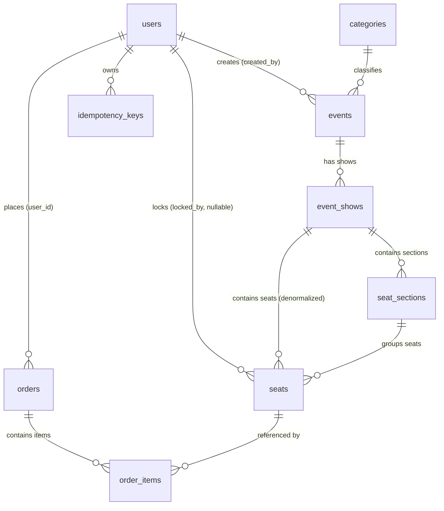

**Quan hệ tổng quan:**

```
users 1──N events           (created_by)
users 1──N orders           (user_id)
users 1──N seats            (locked_by, nullable)

categories 1──N events      (category_id)

events 1──N event_shows     (event_id)

event_shows 1──N seat_sections  (show_id)
event_shows 1──N seats          (show_id, denormalized)

seat_sections 1──N seats    (section_id)

orders 1──N order_items     (order_id)

seats 1──N order_items      (seat_id)
```

---

### 3.2 Chi tiết từng bảng

### `users`

| Cột           | Kiểu         | Ràng buộc                    | Mô tả                    |
| ------------- | ------------ | ---------------------------- | ------------------------ |
| id            | SERIAL       | PK                           | incremental              |
| email         | VARCHAR(255) | UNIQUE, NOT NULL             | Đăng nhập                |
| password_hash | VARCHAR(255) | NOT NULL                     | argon2id                 |
| full_name     | VARCHAR(100) | NOT NULL                     |                          |
| phone         | VARCHAR(20)  | NULLABLE                     | Future: SMS notification |
| date_of_birth | DATE         | NOT NULL                     | Tính demographics (tuổi) |
| gender        | gender_enum  | NOT NULL                     | male / female / other    |
| avatar_url    | VARCHAR(500) | NULLABLE                     | Future: user profile     |
| role          | role_enum    | NOT NULL, DEFAULT 'customer' | admin / customer         |
| is_active     | BOOLEAN      | NOT NULL, DEFAULT true       | Future: ban/deactivate   |
| created_at    | TIMESTAMPTZ  | NOT NULL, DEFAULT NOW()      |                          |
| updated_at    | TIMESTAMPTZ  | NOT NULL, DEFAULT NOW()      |                          |

### `categories`

| Cột        | Kiểu         | Ràng buộc           | Mô tả                        |
| ---------- | ------------ | ------------------- | ---------------------------- |
| id         | SERIAL       | PK                  |                              |
| name       | VARCHAR(100) | NOT NULL            | Tên danh mục (VD: Nhạc sống) |
| slug       | VARCHAR(100) | UNIQUE, NOT NULL    | URL-friendly (VD: nhac-song) |
| sort_order | INT          | NOT NULL, DEFAULT 0 | Thứ tự hiển thị              |

### `events`

| Cột                  | Kiểu              | Ràng buộc                                  | Mô tả                                             |
| -------------------- | ----------------- | ------------------------------------------ | ------------------------------------------------- |
| id                   | SERIAL            | PK                                         |                                                   |
| category_id          | INT               | FK → categories.id, NOT NULL               | Danh mục sự kiện                                  |
| title                | VARCHAR(200)      | NOT NULL                                   |                                                   |
| description          | TEXT              | NOT NULL                                   | Mô tả (Markdown)                                  |
| terms_and_conditions | TEXT              | NULLABLE                                   | Điều khoản                                        |
| venue                | VARCHAR(200)      | NOT NULL                                   |                                                   |
| banner_image_url     | VARCHAR(500)      | NULLABLE                                   | URL ảnh banner                                    |
| static_map_image_url | VARCHAR(500)      | NULLABLE                                   | URL ảnh sơ đồ tĩnh                                |
| min_age              | INTEGER           | NOT NULL, DEFAULT 0, CHECK >= 0            |                                                   |
| max_tickets_per_user | INTEGER           | NOT NULL, DEFAULT 0, CHECK >= 0            | Số vé tối đa một tài khoản mua được trong sự kiện |
| map_config           | JSONB             | DEFAULT {width,height,gridSize,snapToGrid} | Config Canvas cho Map Builder                     |
| stage_layout         | JSONB             | DEFAULT []                                 | Objects hướng dẫn (Sân khấu, Lối vào, FOH)        |
| amenities            | TEXT[]            | NOT NULL, DEFAULT '{}'                     | Tiện ích (wifi, parking, etc.)                    |
| organizer_info       | JSONB             | DEFAULT {}                                 | Thông tin ban tổ chức                             |
| status               | event_status_enum | NOT NULL, DEFAULT 'draft'                  | draft / published / completed / cancelled         |
| created_by           | INT               | FK → users.id, NOT NULL                    | Admin tạo event                                   |
| created_at           | TIMESTAMPTZ       | NOT NULL, DEFAULT NOW()                    |                                                   |
| updated_at           | TIMESTAMPTZ       | NOT NULL, DEFAULT NOW()                    |                                                   |

### `event_shows`

| Cột        | Kiểu             | Ràng buộc                          | Mô tả                                     |
| ---------- | ---------------- | ---------------------------------- | ----------------------------------------- |
| id         | SERIAL           | PK                                 |                                           |
| event_id   | INT              | FK → events.id (CASCADE), NOT NULL | Sự kiện cha                               |
| title      | VARCHAR(200)     | NULLABLE                           | Tên suất diễn (VD: "Đêm 1")               |
| show_date  | DATE             | NOT NULL                           | Ngày diễn                                 |
| start_time | TIMESTAMPTZ      | NOT NULL                           | Giờ bắt đầu                               |
| end_time   | TIMESTAMPTZ      | NULLABLE                           | Giờ kết thúc, CHECK > start_time          |
| itinerary  | JSONB            | DEFAULT []                         | Lịch trình chi tiết                       |
| status     | show_status_enum | NOT NULL, DEFAULT 'draft'          | draft / published / completed / cancelled |
| created_at | TIMESTAMPTZ      | NOT NULL, DEFAULT NOW()            |                                           |
| updated_at | TIMESTAMPTZ      | NOT NULL, DEFAULT NOW()            |                                           |

**Indexes:**

```sql
INDEX idx_event_shows_event ON event_shows(event_id)
```

### `seat_sections`

| Cột            | Kiểu           | Ràng buộc                                  | Mô tả                                   |
| -------------- | -------------- | ------------------------------------------ | --------------------------------------- |
| id             | SERIAL         | PK                                         |                                         |
| show_id        | INT            | FK → event_shows.id (CASCADE), NOT NULL    | Thuộc suất diễn nào                     |
| name           | VARCHAR(50)    | NOT NULL                                   | VIP, Standard, Diamond,...              |
| type           | seat_type_enum | NOT NULL, DEFAULT 'assigned'               | assigned (ghế ngồi) / general (vé đứng) |
| price          | DECIMAL(12,2)  | NOT NULL                                   | Giá mỗi vé trong khu                    |
| capacity       | INT            | NOT NULL, DEFAULT 0                        | Bắt buộc cho vé đứng (general)          |
| sort_order     | INT            | NOT NULL, DEFAULT 0                        | Thứ tự hiển thị                         |
| layout_config  | JSONB          | NOT NULL, DEFAULT {x,y,w,h,rotation,color} | Tọa độ & kích thước trên Canvas         |
| seat_config    | JSONB          | DEFAULT {rows,cols,prefix,rowFormat,...}   | Rule sinh tự động ghế (chỉ assigned)    |
| sales_start_at | TIMESTAMPTZ    | NULLABLE                                   | Thời gian mở bán                        |
| sales_end_at   | TIMESTAMPTZ    | NULLABLE                                   | Thời gian ngừng bán                     |
| created_at     | TIMESTAMPTZ    | NOT NULL, DEFAULT NOW()                    |                                         |

**JSONB Schemas:**

```ts
// layout_config — Vị trí trên Canvas
{ x: number, y: number, width: number, height: number, rotation: number, color: string }

// seat_config — Rule sinh ghế
{ rows: number, cols: number, prefix: string|null,
  rowFormat: 'alphabetic'|'numeric', colDirection: 'ltr'|'rtl',
  startRowIndex: number, startColIndex: number }
```

**Indexes:**

```sql
INDEX idx_seat_sections_show ON seat_sections(show_id)
```

### `seats`

| Cột        | Kiểu             | Ràng buộc                                 | Mô tả                                   |
| ---------- | ---------------- | ----------------------------------------- | --------------------------------------- |
| id         | SERIAL           | PK                                        |                                         |
| section_id | INT              | FK → seat_sections.id (CASCADE), NOT NULL | Khu vực                                 |
| show_id    | INT              | FK → event_shows.id (CASCADE), NOT NULL   | **Denormalized** — tránh JOIN khi query |
| prefix     | VARCHAR(10)      | NOT NULL                                  | Denormalized từ section (VD: VIP, STD)  |
| row_label  | VARCHAR(5)       | NOT NULL                                  | A, B, C, AA... (hoặc "1" cho GA)        |
| col_number | INT              | NOT NULL                                  | 1, 2, 3,...                             |
| status     | seat_status_enum | NOT NULL, DEFAULT 'available'             | available/locked/sold/**disabled**      |
| locked_by  | INT              | FK → users.id (SET NULL), NULLABLE        | Ai đang giữ chỗ                         |
| locked_at  | TIMESTAMPTZ      | NULLABLE                                  | Thời điểm bắt đầu giữ                   |

**Constraints:**

```sql
-- Không trùng label ghế trong cùng một suất diễn
UNIQUE (show_id, prefix, row_label, col_number)
```

**Indexes:**

```sql
INDEX idx_seats_show_status ON seats(show_id, status)   -- Query ghế theo show
INDEX idx_seats_section ON seats(section_id)             -- Query ghế theo section
```

### `orders`

| Cột          | Kiểu              | Ràng buộc                          | Mô tả                             |
| ------------ | ----------------- | ---------------------------------- | --------------------------------- |
| id           | SERIAL            | PK                                 |                                   |
| user_id      | INT               | FK → users.id (RESTRICT), NOT NULL | Người đặt                         |
| total_amount | DECIMAL(12,2)     | NOT NULL                           | Tổng tiền đơn hàng                |
| status       | order_status_enum | NOT NULL, DEFAULT 'pending'        | pending / paid / cancelled        |
| expires_at   | TIMESTAMPTZ       | NOT NULL                           | = created_at + SEAT_LOCK_DURATION |
| created_at   | TIMESTAMPTZ       | NOT NULL, DEFAULT NOW()            |                                   |
| paid_at      | TIMESTAMPTZ       | NULLABLE                           | Thời điểm thanh toán              |
| updated_at   | TIMESTAMPTZ       | NOT NULL, DEFAULT NOW()            |                                   |

> **Lưu ý:** `orders` không có `event_id`. Một order có thể chứa vé từ nhiều show khác nhau trong cùng sự kiện (multi-show cart).

**Indexes:**

```sql
INDEX idx_orders_user ON orders(user_id, status)             -- Vé của tôi
INDEX idx_orders_expires ON orders(status, expires_at)       -- Worker nhả ghế
  WHERE status = 'pending'                                    -- Partial index
```

### `order_items`

| Cột            | Kiểu          | Ràng buộc                          | Mô tả                         |
| -------------- | ------------- | ---------------------------------- | ----------------------------- |
| id             | SERIAL        | PK                                 |                               |
| order_id       | INT           | FK → orders.id (CASCADE), NOT NULL |                               |
| seat_id        | INT           | FK → seats.id (RESTRICT), NOT NULL |                               |
| price_snapshot | DECIMAL(12,2) | NOT NULL                           | Giá ghế **tại thời điểm mua** |
| ticket_code    | VARCHAR(20)   | UNIQUE, NOT NULL                   | Mã vé (VD: "TIX-A3F8K2")      |
| qr_code        | TEXT          | NULLABLE                           | (Planned) Base64 QR           |
| is_checked_in  | BOOLEAN       | NOT NULL, DEFAULT false            | Đã check-in chưa              |
| checked_in_at  | TIMESTAMPTZ   | NULLABLE                           | Thời điểm check-in            |
| created_at     | TIMESTAMPTZ   | NOT NULL, DEFAULT NOW()            |                               |

**Constraints:**

```sql
UNIQUE (ticket_code)
CHECK (is_checked_in = (checked_in_at IS NOT NULL))   -- Consistency check
```

> **Tại sao `price_snapshot`?** Admin đổi giá section sau → đơn hàng cũ vẫn hiển thị đúng giá lúc mua.

### `idempotency_keys`

| Cột        | Kiểu        | Ràng buộc                         | Mô tả                            |
| ---------- | ----------- | --------------------------------- | -------------------------------- |
| key        | TEXT        | PK                                | Client-generated idempotency key |
| user_id    | INT         | FK → users.id (CASCADE), NOT NULL | Scoped to user                   |
| status     | TEXT        | NOT NULL                          | 'processing' / 'completed'       |
| response   | JSONB       | NULLABLE                          | Cached response for replay       |
| created_at | TIMESTAMPTZ | NOT NULL, DEFAULT NOW()           |                                  |

**Indexes:**

```sql
INDEX idx_idempotency_keys_created_at ON idempotency_keys(created_at)
```

### `password_reset_tokens`

| Cột        | Kiểu        | Ràng buộc                       | Mô tả                          |
| :--------- | :---------- | :------------------------------ | :----------------------------- |
| token_hash | VARCHAR(64) | PK                              | Bản băm HMAC-SHA256 của token  |
| user_id    | INT         | FK → users.id (CASCADE), UNIQUE | Mỗi user chỉ có 1 token active |
| expires_at | TIMESTAMPTZ | NOT NULL                        | Thời điểm hết hạn (1 giờ)      |

---

### 3.3 Enum Definitions

```sql
CREATE TYPE role           AS ENUM ('admin', 'customer');
CREATE TYPE gender         AS ENUM ('male', 'female', 'other');
CREATE TYPE event_status   AS ENUM ('draft', 'published', 'completed', 'cancelled');
CREATE TYPE show_status    AS ENUM ('draft', 'published', 'completed', 'cancelled');
CREATE TYPE seat_type      AS ENUM ('assigned', 'general');        -- assigned = Ngồi, general = Đứng
CREATE TYPE seat_status    AS ENUM ('available', 'locked', 'sold', 'disabled');
CREATE TYPE order_status   AS ENUM ('pending', 'paid', 'cancelled');
```

> **Lưu ý:** `event_status` không có `sold_out` — đó là trạng thái tính toán (derived) từ seat counts.

---

### 3.4 Index Strategy

| Index                             | Bảng             | Cột                                             | Mục đích                         |
| --------------------------------- | ---------------- | ----------------------------------------------- | -------------------------------- |
| `users_email_unique`              | users            | email (UNIQUE)                                  | Đăng nhập, check trùng           |
| `idx_event_shows_event`           | event_shows      | (event_id)                                      | Lấy shows theo event             |
| `idx_seat_sections_show`          | seat_sections    | (show_id)                                       | Lấy sections theo show           |
| `uq_seat_label_per_show`          | seats            | (show_id, prefix, row_label, col_number) UNIQUE | Không trùng label ghế trong show |
| `idx_seats_show_status`           | seats            | (show_id, status)                               | Lấy sơ đồ ghế theo show          |
| `idx_seats_section`               | seats            | (section_id)                                    | Lấy ghế theo section             |
| `idx_orders_user`                 | orders           | (user_id, status)                               | "Vé của tôi"                     |
| `idx_orders_expires`              | orders           | (status, expires_at) WHERE pending              | Worker nhả ghế hết hạn           |
| `uq_ticket_code`                  | order_items      | (ticket_code) UNIQUE                            | Lookup vé theo mã                |
| `idx_idempotency_keys_created_at` | idempotency_keys | (created_at)                                    | Cleanup old keys                 |
| `idx_orders_analytics`            | orders           | `(status, created_at)` WHERE `paid`             | Tối ưu đếm Doanh thu / Velocity  |
| `idx_orders_dropoff`              | orders           | `(status)` WHERE `paid` OR `cancelled`          | Tối ưu tính tỉ lệ rớt giỏ hàng   |
| `idx_users_demographics`          | users            | `(gender, date_of_birth)`                       | Tối ưu biểu đồ Nhân khẩu học     |

**Tại sao chọn những index này:**

```
Query phổ biến nhất:
──────────────────────────────────────────────────────────────
1. Lấy ghế theo show      → idx_seats_show_status
   SELECT * FROM seats WHERE show_id = 5 AND status = 'available'

2. Worker nhả ghế          → idx_orders_expires (partial)
   SELECT * FROM orders WHERE status = 'pending' AND expires_at < NOW()

3. Vé của tôi              → idx_orders_user
   SELECT * FROM orders WHERE user_id = 123 AND status = 'paid'

4. Đăng nhập               → users_email_unique
   SELECT * FROM users WHERE email = 'alice@gmail.com'
```

---

### 3.5 Naming Convention & Seat Metrics

Để giải quyết bài toán có các ghế bị vô hiệu hóa (`disabled`) trong ma trận lưới, hệ thống KHÔNG sử dụng từ khóa `total_seats` gây nhầm lẫn. Thay vào đó, API và Frontend thống nhất sử dụng bộ từ vựng sau cho việc thống kê ghế:

| Tên biến chuẩn  | Ý nghĩa nghiệp vụ                                                                                 | Cách tính (Logic Database)             |
| --------------- | ------------------------------------------------------------------------------------------------- | -------------------------------------- |
| **`capacity`**  | **Sức chứa vật lý:** Tổng toàn bộ số ghế sinh ra từ ma trận lưới (bao gồm cả ghế hỏng/vướng cột). | `COUNT(id)` (hoặc `rows * cols`)       |
| **`sellable`**  | **Ghế mở bán:** Tổng số ghế thực tế có thể bán cho khách.                                         | `COUNT(id) WHERE status != 'disabled'` |
| **`disabled`**  | **Ghế vô hiệu hóa:** Số ghế bị khóa cứng bởi Admin.                                               | `COUNT(id) WHERE status = 'disabled'`  |
| **`available`** | **Ghế trống:** Số ghế hiện tại khách có thể click mua.                                            | `COUNT(id) WHERE status = 'available'` |
| **`locked`**    | **Ghế đang giữ:** Số ghế đang nằm trong đơn hàng `pending`.                                       | `COUNT(id) WHERE status = 'locked'`    |
| **`sold`**      | **Ghế đã bán:** Số ghế đã thanh toán thành công.                                                  | `COUNT(id) WHERE status = 'sold'`      |

**Công thức toàn vẹn dữ liệu:**

- `capacity` = `sellable` + `disabled`
- `sellable` = `available` + `locked` + `sold`

_(Lưu ý: Output của các API như `GET /api/events/[id]` và `GET /api/stats/occupancy` bắt buộc phải trả về object chứa các keys này thay vì mảng đếm gộp)._

---

### 3.6 Seed Data

**Tài khoản seed để demo:**

| Email              | Password | Role     |
| ------------------ | -------- | -------- |
| admin@tixtac.io.vn | 12345678 | Admin    |
| alice@gmail.com    | 12345678 | Customer |
| bob@gmail.com      | 12345678 | Customer |
| charlie@gmail.com  | 12345678 | Customer |
| diana@gmail.com    | 12345678 | Customer |
| eve@gmail.com      | 12345678 | Customer |

---

## 4. Thiết kế các luồng kỹ thuật trọng tâm

### 4.1 Purchase Flow — Hold Seats (Cart-based, Idempotent)

Hệ thống sử dụng mô hình **Cart Replacement**: mỗi lần customer gửi request mua vé, toàn bộ giỏ hàng được so sánh với đơn hàng hiện có để thêm/bớt ghế.

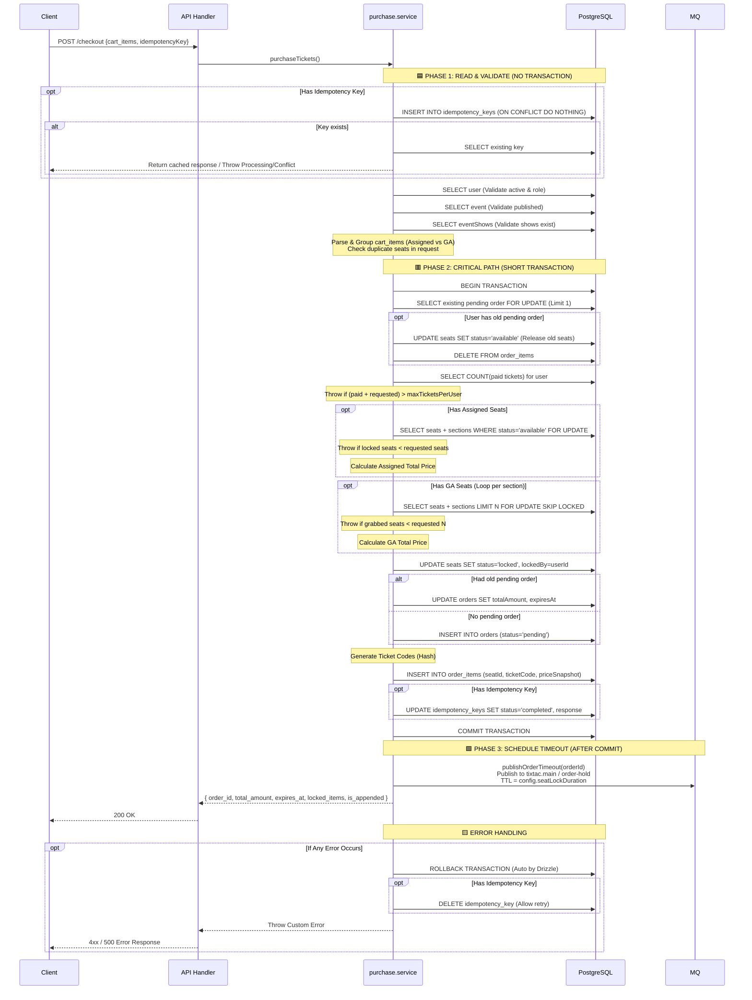

**Khi 2 requests đồng thời:**

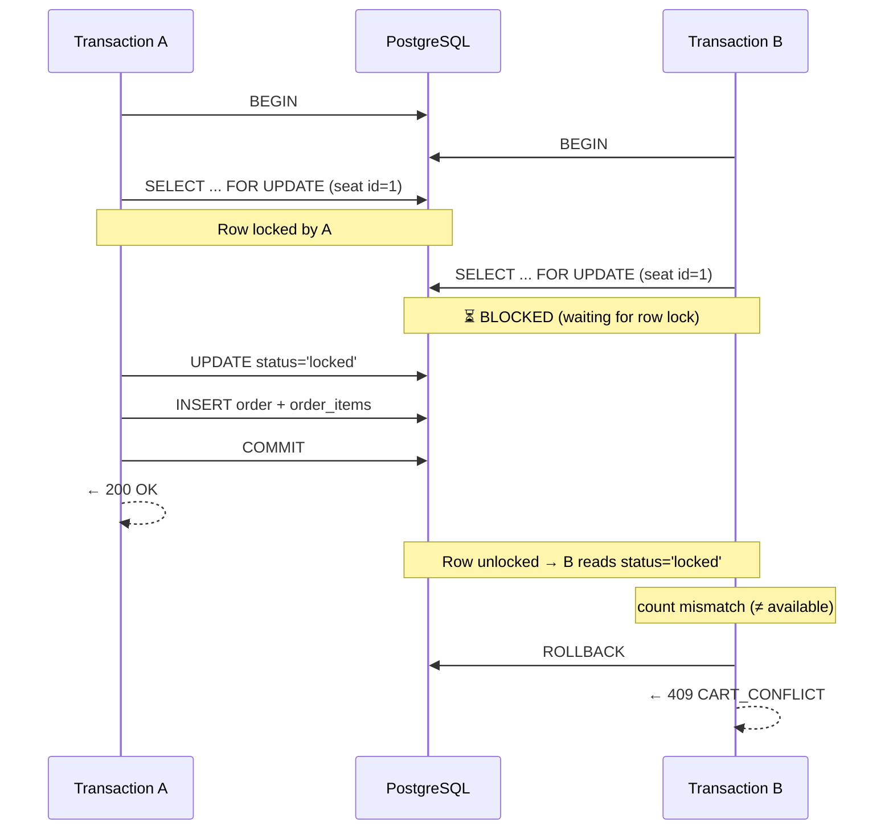

### 4.2 Checkout (Payment)

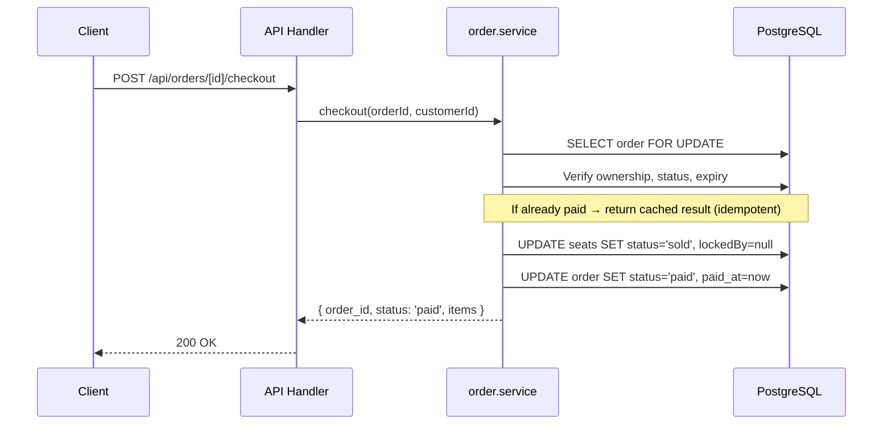

---

### 4.3 Auto-Release — Message Queue

Sử dụng CloudAMQP với cơ chế **Dead Letter Exchange (DLX)**. Không dùng `setTimeout` vì sẽ mất data nếu server restart.

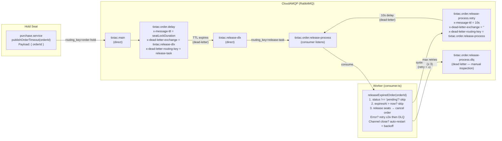

**Topology chi tiết:**

| Thành phần                           | Loại              | Mô tả                                                                         |
| ------------------------------------ | ----------------- | ----------------------------------------------------------------------------- |
| `tixtac.main`                        | Exchange (direct) | Nhận message từ publisher                                                     |
| `tixtac.release-dlx`                 | Exchange (direct) | Dead-letter exchange cho delay queue                                          |
| `tixtac.order.delay`                 | Queue             | Delay queue, TTL = `config.seatLockDuration` giây, DLX → `tixtac.release-dlx` |
| `tixtac.order.release-process`       | Queue             | Queue xử lý chính, consumer lắng nghe                                         |
| `tixtac.order.release-process.retry` | Queue             | Retry queue, TTL = 10s, dead-letter quay lại `tixtac.order.release-process`   |
| `tixtac.order.release-process.dlq`   | Queue             | Dead Letter Queue — message lỗi sau 3 lần retry, cần xử lý thủ công           |

**Flow xử lý:**

1. **Publish:** `purchase.service` gọi `publishOrderTimeout(orderId)` → gửi message `{ orderId }` vào `tixtac.main` với routing key `order-hold`.
2. **Delay:** Message nằm trong `tixtac.order.delay` trong `seatLockDuration` giây (mặc định 600s = 10 phút).
3. **Dead-letter:** Khi TTL hết hạn, message được chuyển qua `tixtac.release-dlx` với routing key `release-task` → đến `tixtac.order.release-process`.
4. **Consume:** Worker gọi `orderService.releaseExpiredOrder(orderId)`:
   - Nếu order không tồn tại hoặc `status !== 'pending'` → bỏ qua (idempotent).
   - Nếu `expiresAt > now` (message đến sớm do re-publish khi cart thay đổi) → bỏ qua.
   - Nếu `status = 'pending'` và `expiresAt <= now` → release ghế (`locked` → `available`), hủy order (`pending` → `cancelled`).
5. **Retry:** Nếu có lỗi hệ thống (DB down, network), message được gửi vào `tixtac.order.release-process.retry` với header `x-retry` tăng dần. Sau 10s, message quay lại `tixtac.order.release-process`. Tối đa 3 lần retry.
6. **DLQ:** Sau 3 lần retry thất bại, message được đưa vào `tixtac.order.release-process.dlq` để kiểm tra thủ công.
7. **Auto-restart:** Nếu channel đóng, worker tự động reconnect với exponential backoff (max 30s).

**Payload message (đơn giản hóa):**

```json
{ "orderId": 123 }
```

Chỉ chứa `orderId` — consumer tự tra DB để lấy thông tin mới nhất, tránh stale data từ message cũ khi cart bị thay thế và re-publish timeout.

---

### 4.4 Server-Sent Events (SSE)

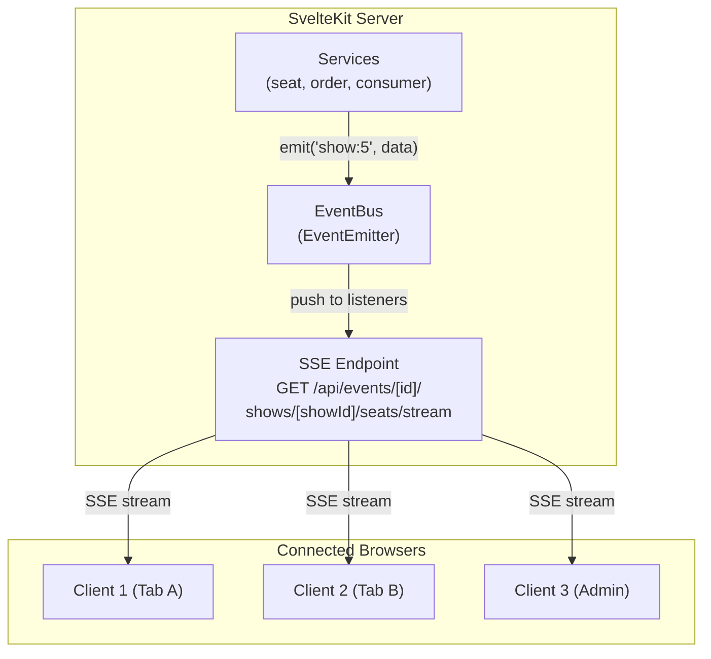

Để đồng bộ trạng thái sơ đồ ghế cho hàng ngàn trình duyệt mà không cần F5.

- **Tại sao cần Redis Pub/Sub?** Nếu Server A nhận request giữ chỗ, chỉ Server A biết. Nhưng User B có thể đang kết nối SSE tới Server B. Redis Pub/Sub làm cầu nối giữa các server.
- **Flow:**
  1. User kết nối `GET /api/events/[id]/shows/[showId]/seats/stream`. Server mở luồng `ReadableStream` và subscribe Redis channel `show:{showId}:updates`.
  2. Khi có request Hold ghế thành công, Service gọi: `redis.publish('show:5:updates', JSON.stringify({ seatIds: [1,2], status: 'locked' }))`.
  3. Mọi server nhận message từ Redis → Bắn data xuống tất cả client đang giữ kết nối SSE.

---

### 4.5 Virtual Queue & Active Session Protection

Sử dụng Upstash Redis để quản lý state tập trung, chống quá tải Database. Luồng xếp hàng được thiết kế với tiêu chuẩn bảo mật cao (JWE) và bảo vệ trải nghiệm người dùng tối đa.

1. **Cấu trúc Redis:**
   - `user_current_queue:{userId}` (String): Lưu `eventId`. Dùng để chặn xếp hàng chéo (1 User chỉ được tham gia 1 Queue).
   - `active_users:{eventId}` (ZSET): Chứa ID user đang được phép mua vé. Score là timestamp hết hạn.
   - `waiting_queue:{eventId}` (ZSET): Chứa ID user đang xếp hàng. Score là timestamp bắt đầu chờ.
   - `push_sub:{userId}` (String): Lưu PushSubscription để bắn Web Push khi tới lượt.
2. **Luồng vào (Gatekeeper):**
   - User truy cập → Check `user_current_queue`. Nếu đang ở sự kiện khác → Block (HTTP 409).
   - Check size `active_users`. Nếu < `MAX` → Cấp slot (5 phút), trả về **JWE Seat Access Token** + `expiresAt`.
   - Nếu ≥ `MAX` → `ZADD waiting_queue` → Trả về trạng thái "Đang chờ".
3. **Luồng xả & Grace Period (Worker mỗi 3s):**
   - Dọn dẹp user hết hạn khỏi `active_users` và xóa `user_current_queue` của họ.
   - Bốc user từ `waiting_queue` sang `active_users` nhưng **CHỈ CẤP 1 PHÚT (Grace Period)**. Đồng thời gọi PushForge bắn **Web Push Notification** gọi user quay lại.
   - User quay lại bấm "Vào mua" → Gọi API `/confirm` → Gia hạn lên 5 phút.

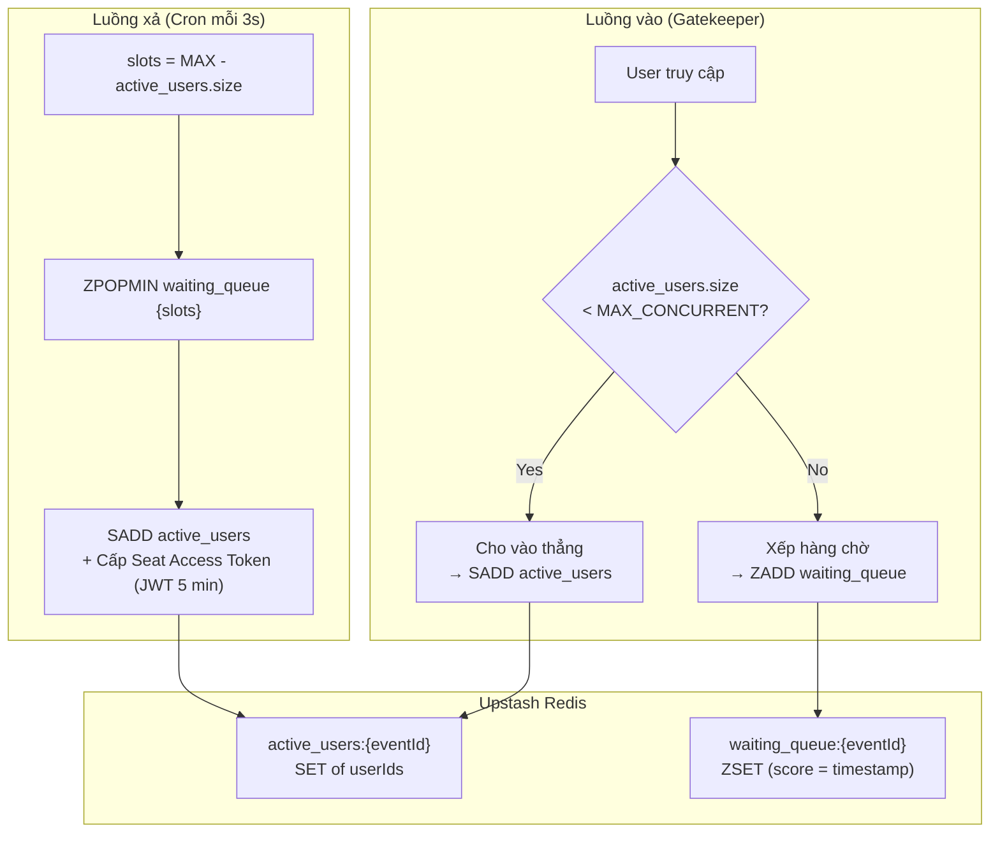

**Access Token Flow:**

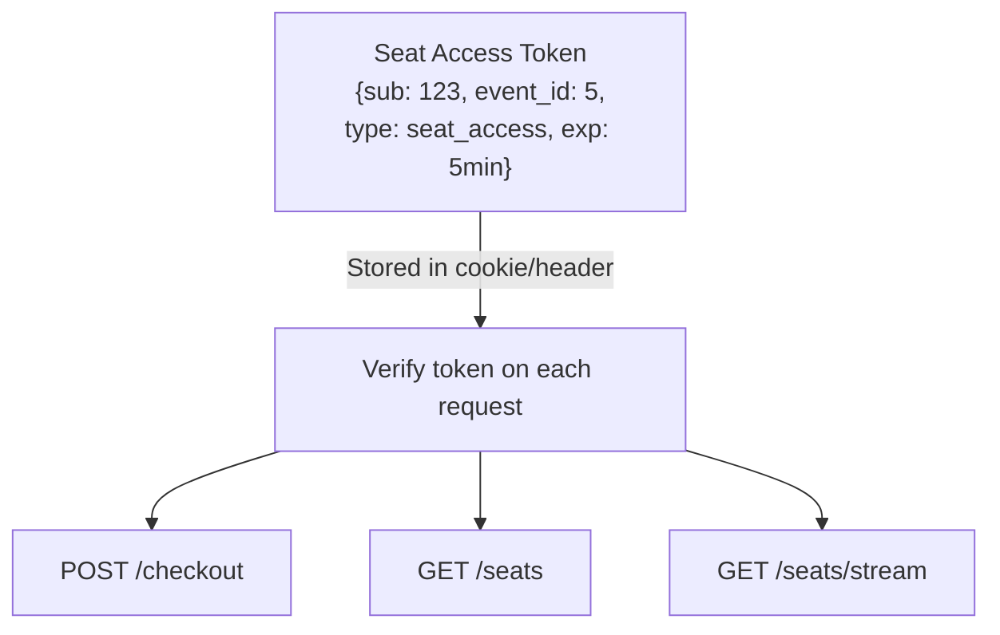

### 4.6 Web Push Notification (PushForge)

Giải quyết bài toán user rời tab khi đang xếp hàng.

- **Frontend:** Xin quyền Notification, gọi `pushManager.subscribe()`, gửi object keys lên API.
- **Backend:** Lưu subscription vào Upstash Redis (TTL 2 giờ).
- **Worker:** Khi xả hàng chờ, dùng `@pushforge/builder` (Zero-dependency Web Crypto API) bọc payload và gửi POST request thẳng tới FCM/APNs. Đặt header `ttl: 60` (chỉ sống 60s khớp với Grace Period).

### 4.7 Password Reset & Email (Resend + Bun Crypto)

Bảo mật tối đa cho luồng khôi phục mật khẩu.

- **Sinh Token:** Dùng `crypto.getRandomValues` (CSPRNG) sinh chuỗi 32 bytes ngẫu nhiên.
- **Bảo mật (HMAC-SHA256):** Dùng `Bun.CryptoHasher` kết hợp Secret Key để băm token trước khi lưu vào DB. Chống lộ token kể cả khi DB bị hack.
- **Gửi Email:** Render template HTML trực tiếp từ Svelte component bằng `better-svelte-email`, gửi qua API của `Resend`.

### 4.8 SSR QR Code (etiket)

Mã QR trên vé được sinh ra bằng kỹ thuật SSR (Server-Side Rendering) thông qua thư viện `etiket`.

- Không lưu ảnh QR vào Database.
- Trình duyệt nhận chuỗi `<svg>` thuần túy ngay khi load HTML, không cần tải thư viện JS nặng nề ở client.
- CSS ép nền trắng vân đen để đảm bảo máy quét vật lý đọc được kể cả khi user dùng Dark Mode.

---

## 5. Thiết kế xác thực & phân quyền (Auth)

### 5.1 JWT Token Structure

```
┌──────────────────────────────────┐
│         Auth Token               │
│──────────────────────────────────│
│  Header:  { alg: HS256 }        │
│  Payload: {                      │
│    sub: 123,        // user_id   │
│    role: "customer",             │
│    iat: 1716000000,              │
│    exp: 1716086400  // 24 giờ    │
│  }                               │
│  Signature: HMAC-SHA256          │
└──────────────────────────────────┘

┌──────────────────────────────────┐
│ Seat Access Token (JWE Encrypted)│
│──────────────────────────────────│
│  Header:  { alg: dir, enc: A256GCM }
│  Ciphertext: (Mã hóa hoàn toàn payload)
│  * Payload ẩn bên trong: {       │
│      iss: "tixtac:queue",        │
│      aud: "tixtac:booking",      │
│      sub: 123, event_id: 5       │
│  }                               │
└──────────────────────────────────┘
```

### 5.2 Auth Flow

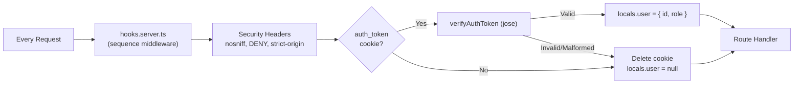

```tsx
// src/hooks.server.ts
const securityHeaders: Handle = async ({ event, resolve }) => {
  const response = await resolve(event);
  response.headers.set('X-Content-Type-Options', 'nosniff');
  response.headers.set('X-Frame-Options', 'DENY');
  response.headers.set('Referrer-Policy', 'strict-origin-when-cross-origin');
  return response;
};

const auth: Handle = async ({ event, resolve }) => {
  const token = event.cookies.get('auth_token');
  if (token) {
    try {
      const payload = await verifyAuthToken(token);
      event.locals.user = { id: payload.sub, role: payload.role };
    } catch {
      event.cookies.delete('auth_token', { path: '/' });
      event.locals.user = null;
    }
  }
  return resolve(event);
};

export const handle = sequence(securityHeaders, auth);
```

### 5.3 Route Protection

| Route                             | Protection                       |
| --------------------------------- | -------------------------------- |
| `/`                               | Public                           |
| `/events/[id]`                    | Public                           |
| `/login`                          | Public (redirect if logged in)   |
| `/register`                       | Public (redirect if logged in)   |
| `/events/[id]/seats`              | Customer + Access Token          |
| `/events/[id]/queue`              | Customer                         |
| `/me/tickets`                     | Customer                         |
| `/admin/*`                        | Admin only (layout server guard) |
| `/api/auth/*`                     | Public                           |
| `/api/events` (GET)               | Public                           |
| `/api/events/[id]` (GET)          | Public                           |
| `/api/categories`                 | Public                           |
| `/api/events/[id]/checkout`       | Customer                         |
| `/api/orders/[id]/checkout`       | Customer (own order)             |
| `/api/events/create/*`            | Admin only                       |
| `/api/events/[id]/publish`        | Admin only                       |
| `/api/events/[id]/shows/[showId]` | Admin only                       |
| `/api/me/tickets`                 | Customer                         |

---

## 6. API Endpoints Summary

### 6.1 Public

| Method | Endpoint                    | Mô tả                                 |
| ------ | --------------------------- | ------------------------------------- |
| POST   | `/api/auth/register`        | Đăng ký                               |
| POST   | `/api/auth/login`           | Đăng nhập                             |
| POST   | `/api/auth/logout`          | Đăng xuất (xóa auth cookie)           |
| GET    | `/api/events`               | Danh sách + tìm kiếm                  |
| GET    | `/api/events/[id]`          | Chi tiết sự kiện                      |
| GET    | `/api/categories`           | Danh sách danh mục                    |
| POST   | `/api/auth/forgot-password` | Gửi email khôi phục (Rate limit 3/hr) |
| POST   | `/api/auth/reset-password`  | Đặt lại mật khẩu với HMAC token       |

### 6.2 Customer

| Method | Endpoint                                | Mô tả                                             |
| ------ | --------------------------------------- | ------------------------------------------------- |
| GET    | `/api/events/[id]/shows/[showId]/seats` | Lấy sơ đồ ghế cho suất diễn                       |
| POST   | `/api/events/[id]/checkout`             | Mua vé (hold seats, cart replacement, idempotent) |
| POST   | `/api/orders/[id]/checkout`             | Thanh toán đơn hàng                               |
| GET    | `/api/me/tickets`                       | Vé của tôi (pending orders + paid tickets)        |
| POST   | `/api/events/[id]/queue`                | Xin slot Queue (Gatekeeper)                       |
| GET    | `/api/events/[id]/queue/status`         | Polling lấy STT hoặc trạng thái                   |
| POST   | `/api/events/[id]/queue/confirm`        | Xác nhận vào mua (Gia hạn 5 phút)                 |
| DELETE | `/api/events/[id]/queue`                | Hủy/Thoát hàng chờ                                |
| POST   | `/api/me/push-subscription`             | Lưu Web Push keys vào Redis                       |
| PATCH  | `/api/me/profile`                       | Sửa thông tin cá nhân                             |
| PATCH  | `/api/me/security`                      | Đổi Mật khẩu / Email                              |

### 6.3 Admin — Event Creation (3-Step Flow)

| Method | Endpoint                        | Mô tả                                            |
| ------ | ------------------------------- | ------------------------------------------------ |
| POST   | `/api/events/create/basic-info` | Step 1: Tạo draft event (thông tin cơ bản)       |
| PATCH  | `/api/events/create/basic-info` | Step 1: Cập nhật thông tin cơ bản                |
| POST   | `/api/events/create/shows`      | Step 2: Thêm suất diễn                           |
| PUT    | `/api/events/create/shows`      | Step 2: Cập nhật suất diễn (add/remove/update)   |
| POST   | `/api/events/create/seatmap`    | Step 3: Thêm seatmap (sections + seats) cho show |

### 6.4 Admin — Event Management

| Method | Endpoint                          | Mô tả                                           |
| ------ | --------------------------------- | ----------------------------------------------- |
| PATCH  | `/api/events/[id]/publish`        | Chuyển event từ draft → published               |
| PUT    | `/api/events/[id]/shows/[showId]` | Thay thế sections & seats cho show (draft only) |
| PATCH  | `/api/events/[id]/shows/[showId]` | Cập nhật metadata show (date, time, itinerary)  |
| DELETE | `/api/events/[id]/shows/[showId]` | Xóa show (cascade sections & seats)             |
| PUT    | `/api/events/[id]/sections`       | Thay thế toàn bộ sections & seats (draft only)  |

### 6.5 Planned

| Method | Endpoint                                       | Mô tả                                   |
| ------ | ---------------------------------------------- | --------------------------------------- |
| POST   | `/api/events/[id]/queue`                       | Đăng ký hàng chờ chung cho toàn sự kiện |
| GET    | `/api/events/[id]/queue`                       | Check vị trí hàng chờ (Polling)         |
| GET    | `/api/events/[id]/shows/[showId]/seats/stream` | SSE realtime cho suất diễn đang xem     |
| GET    | `/api/stats/revenue`                           | Doanh thu (admin)                       |
| GET    | `/api/stats/occupancy`                         | Tỉ lệ lấp đầy (admin)                   |
| GET    | `/api/stats/demographics`                      | Demographics (admin)                    |

---

## 7. Chiến lược Error Handling tập trung

Hệ thống sử dụng cơ chế xử lý lỗi thống nhất từ Client đến Database, đảm bảo mã nguồn gọn gàng, không lặp lại `try/catch` và trả về format chuẩn cho mọi API.

### 7.1 Flow xử lý lỗi tổng quan

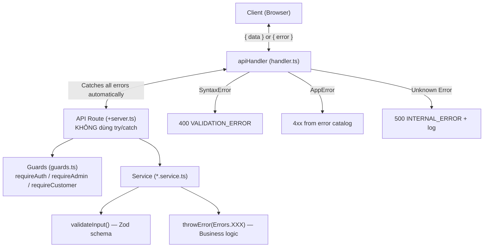

### 7.2 Định nghĩa lỗi (`AppError` & `Errors` Catalog)

Tất cả lỗi nghiệp vụ sử dụng class `AppError` và được định nghĩa sẵn tại `src/lib/server/errors.ts`:

- **Static Errors:** Lỗi cố định không cần chi tiết. Cách gọi: `throwError(Errors.UNAUTHORIZED)`. (Ví dụ: `UNAUTHORIZED`, `FORBIDDEN`, `NO_SEATS`, `SEAT_NOT_AVAILABLE`, `LOCK_EXPIRED`).
- **Dynamic Errors:** Lỗi cần truyền thêm data chi tiết. Cách gọi: `throw Errors.VALIDATION(details)`, `throw Errors.CART_CONFLICT(details)`.

### 7.3 `apiHandler` - Bắt lỗi tự động

Tất cả API Routes bắt buộc bọc trong `apiHandler`. Handler này tự động map lỗi thành Response HTTP:

- `SyntaxError` (lỗi parse JSON) → HTTP 400 (VALIDATION_ERROR).
- `AppError` → HTTP 4xx (Tuỳ thuộc status code định nghĩa).
- `Unknown Error` (Lỗi DB, Lỗi hệ thống) → HTTP 500 (INTERNAL_ERROR) và ghi log server.

### 7.4 Format Response thống nhất

**✅ Thành công (2xx):**

```json
{
  "data": { "id": 1, "status": "success" }
}
```

**❌ Lỗi thông thường (4xx, 5xx):**

```json
{
  "error": {
    "code": "UNAUTHORIZED",
    "message": "Vui lòng đăng nhập"
  }
}
```

**❌ Lỗi Validation (400 - Có details từng field):**

```json
{
  "error": {
    "code": "VALIDATION_ERROR",
    "message": "Dữ liệu không hợp lệ",
    "details": {
      "seat_ids": "Vui lòng chọn ít nhất 1 ghế"
    }
  }
}
```

**❌ Lỗi Cart Conflict (409 - Có chi tiết ghế không khả dụng):**

```json
{
  "error": {
    "code": "CART_CONFLICT",
    "message": "Một số vé trong giỏ hàng đã bị người khác mua hoặc không đủ số lượng",
    "details": { ... }
  }
}
```

### 7.5 Ví dụ tích hợp hoàn chỉnh (Purchase Tickets)

**1. Service (Xử lý logic & Validation):**

```tsx
// src/lib/server/services/purchase.service.ts
export const purchaseService = {
  async purchaseTickets(
    userId: number,
    eventId: number,
    body: PurchaseBody,
    idempotencyKey?: string,
  ) {
    return await db.transaction(async (tx) => {
      // Idempotency check (INSERT ON CONFLICT)
      // 1. Validate user & event
      // 2. Validate cart items (shows, sections, sales window)
      // 3. Resolve existing pending orders
      // 4. Clean up expired orders (release seats, restore GA capacity)
      // 5. Cart replacement (remove items no longer in cart)
      // 6. Check per-user ticket limit
      // 7. Lock seats (FOR UPDATE / FOR UPDATE SKIP LOCKED for GA)
      // 8. Deduct GA capacity
      // 9. Create/update order + order_items
      // 10. Return response & save idempotency
    });
  },
};
```

**2. API Route (Cực kỳ mỏng, không try/catch):**

```tsx
// src/routes/api/events/[id]/checkout/+server.ts
import { apiHandler } from '$lib/server/handler';
import { requireCustomer } from '$lib/server/auth/guards';

export const POST = apiHandler(async ({ request, params, locals }) => {
  const user = requireCustomer(locals); // Tự throw nếu chưa login
  const body = await request.json(); // apiHandler tự bắt SyntaxError

  const result = await purchaseService.purchaseTickets(user.id, Number(params.id), body);

  return json({ data: result }, { status: 200 });
});
```

---

## 8. Cấu hình môi trường (Environment Config)

```tsx
// src/lib/server/config.ts
import { dev } from '$app/environment';
import { env } from '$env/dynamic/private';
import { z } from 'zod';

// Schema: single source of truth for env validation + type coercion
const envSchema = z.object({
  JWT_SECRET: z.string().min(1, 'JWT_SECRET is required'),
  JWT_EXPIRES_IN: z.string().default('24h'),
  SEAT_LOCK_DURATION: z.coerce.number().int().positive().default(600),
  MAX_CONCURRENT_USERS: z.coerce.number().int().positive().default(200),
  ACCESS_TOKEN_DURATION: z.coerce.number().int().positive().default(300),
  CLOUDAMQP_URL: z.string().min(1, 'CLOUDAMQP_URL is required'),
  UPSTASH_REDIS_REST_URL: z.string().url(),
  UPSTASH_REDIS_REST_TOKEN: z.string().min(1),
  RESEND_API_KEY: z.string().min(1),
  VAPID_PUBLIC_KEY: z.string().min(1),
  VAPID_PRIVATE_KEY_JWK: z.string().min(1),
});

// Parse & validate (fail fast in ALL environments)
const result = envSchema.safeParse({
  JWT_SECRET: env.JWT_SECRET,
  JWT_EXPIRES_IN: env.JWT_EXPIRES_IN,
  SEAT_LOCK_DURATION: env.SEAT_LOCK_DURATION,
  MAX_CONCURRENT_USERS: env.MAX_CONCURRENT_USERS,
  ACCESS_TOKEN_DURATION: env.ACCESS_TOKEN_DURATION,
  CLOUDAMQP_URL: env.CLOUDAMQP_URL,
  UPSTASH_REDIS_REST_URL: env.UPSTASH_REDIS_REST_URL,
  UPSTASH_REDIS_REST_TOKEN: env.UPSTASH_REDIS_REST_TOKEN,
  RESEND_API_KEY: env.RESEND_API_KEY,
  VAPID_PUBLIC_KEY: env.VAPID_PUBLIC_KEY,
  VAPID_PRIVATE_KEY_JWK: env.VAPID_PRIVATE_KEY_JWK,
});

if (!result.success) {
  // Startup error → plain Error, NOT AppError (no HTTP context here)
  throw new Error(`❌ Invalid environment configuration:\n  • ${message}`);
}

const parsed = result.data;

// ─── Export typed, camelCase-only config ───
export const config = {
  isDev: dev,
  jwtSecret: parsed.JWT_SECRET,
  jwtExpiresIn: parsed.JWT_EXPIRES_IN,
  seatLockDuration: parsed.SEAT_LOCK_DURATION,
  maxConcurrentUsers: parsed.MAX_CONCURRENT_USERS,
  accessTokenDuration: parsed.ACCESS_TOKEN_DURATION,
  cloudAmqpUrl: parsed.CLOUDAMQP_URL,
  upstashUrl: parsed.UPSTASH_REDIS_REST_URL,
  upstashToken: parsed.UPSTASH_REDIS_REST_TOKEN,
  resendApiKey: parsed.RESEND_API_KEY,
  vapidPublicKey: parsed.VAPID_PUBLIC_KEY,
  vapidPrivateKeyJwk: parsed.VAPID_PRIVATE_KEY_JWK,
} as const;
```

---

## 9. Deployment Architecture

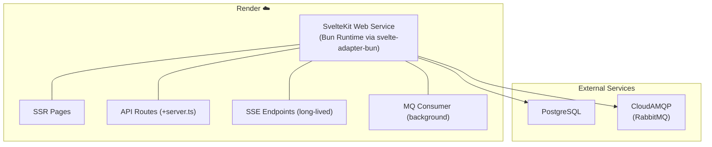

---

```
MQ Consumer Lifecycle:
──────────────────────────────────────────────────
Startup:
  SvelteKit hooks.server.ts hoặc server init
  → Import consumer.ts
  → Connect to CloudAMQP
  → Start consuming 'seat-release-process' queue

Reconnect:
  amqplib auto-reconnect on connection drop
  Consumer re-attach to queue after reconnect

Shutdown:
  Graceful: close channel → close connection
  (Render sends SIGTERM → process.on('SIGTERM', cleanup))

Lưu ý:
  Consumer chạy CÙNG process với web server (không tách worker)
  → Đơn giản, phù hợp single instance Render
  → Nếu scale ra nhiều instance → cần tách consumer riêng
```

---

## 10. Tech Stack

| Concern                | Technology                               |
| ---------------------- | ---------------------------------------- |
| Framework              | SvelteKit (Svelte 5)                     |
| Runtime                | Bun                                      |
| Language               | TypeScript                               |
| Database               | PostgreSQL + Drizzle ORM                 |
| Auth/Password          | JWT (jose) + argon2 password hashing     |
| Validation             | Zod (shared FE/BE schemas)               |
| Message Queue          | CloudAMQP (RabbitMQ via amqplib)         |
| UI Components          | Tailwind CSS 4 + shadcn-svelte + bits-ui |
| Icons                  | Lucide                                   |
| Seat Map Builder       | Konva (svelte-konva)                     |
| Charts                 | LayerChart                               |
| Carousel               | Embla Carousel                           |
| Cache & Queue State    | Upstash Redis                            |
| Email Service          | Resend + better-svelte-email             |
| Web Push Notifications | @pushforge/builder (Web Crypto API)      |
| QR Code (SSR)          | etiket                                   |
| Unit Testing           | bun:test                                 |
| Deployment             | Render (svelte-adapter-bun)              |

---

## 11. Project Structure

```
src/
├── routes/
│   ├── (admin)/admin/          # Admin layout group (sidebar + header)
│   ├── (auth)/                 # Login / Register
│   ├── (customer)/             # Customer-facing pages (navbar + footer)
│   └── api/                    # REST API endpoints
├── lib/
│   ├── components/
│   │   ├── admin/              # Admin-specific components (event editor, seatmap builder)
│   │   ├── customer/           # Customer-specific components (event cards, ticket cards)
│   │   ├── seat-map/           # Shared seat map viewer (SeatItem, SectionBlock, SummaryBar)
│   │   └── ui/                 # shadcn-svelte primitives (button, badge, popover, etc.)
│   ├───emails                  # Template email Svelte (Resend)
│   │   └───ResetPassword.svelte
│   ├── server/
│   │   ├── auth/               # JWT, password hashing, guards
│   │   ├── db/                 # Drizzle schema, client, seed scripts
│   │   ├── mq/                 # AMQP connection (CloudAMQP)
│   │   ├── services/           # Business logic layer
│   │   ├── validators/         # Domain validators (seat overlap, disabled seats)
│   │   ├── config.ts           # Env validation (Zod, fail-fast)
│   │   ├── errors.ts           # AppError class + error catalog
│   │   ├───redis.ts            # Upstash Redis client
│   │   └───push.ts             # PushForge builder config
│   │   └── handler.ts          # apiHandler wrapper
│   ├── shared/
│   │   └── schemas/            # Zod schemas (shared FE/BE)
│   ├── stores/                 # Svelte 5 runes stores (event-create, seat-selection, toast)
│   ├── types/                  # TypeScript types (db, event-detail, purchase, seat-map)
│   └── utils/                  # Utilities (api, datetime, price, seat-label, ticket-code)
├── hooks.server.ts             # Auth + Security Headers middleware (sequence)
└── app.html                    # HTML shell

```
